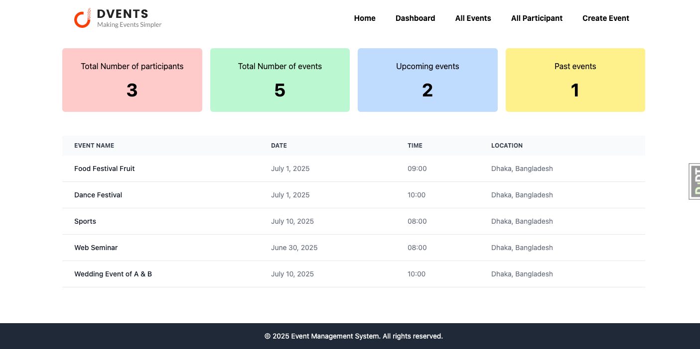
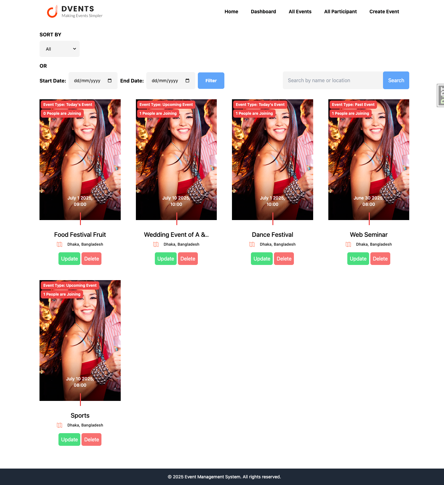
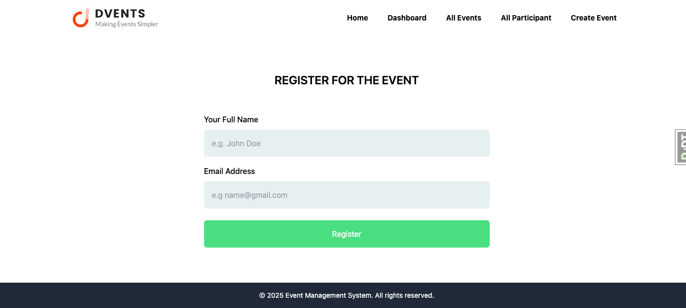

# 🎉 Event Management System

A dynamic and responsive web application for managing events efficiently. Users can create, view, update, delete, and register for events, while admins can monitor and control the entire event lifecycle via a powerful dashboard.


---

## ✨ Features

### 🧑‍💻 User Functionalities

- **Create Events** – Easily create new events with relevant details.
- **View Events** – Browse through all available events.
- **Filter Events** – Filter events by **category** and **date**.
- **Search Events** – Full-text search support by event **name** or **location**.
- **Register for Events** – Users can register for multiple events with real-time validation and status updates.

### 🛠️ Admin Capabilities

- **Dashboard Overview** – View **today’s**, **upcoming**, and **past** events with a **total count**.
- **Manage Registrations** – View, update, or delete registered users.
- **Event Control** – Update or delete events from the admin panel.

### 💻 UI/UX

- Fully responsive, user-friendly interface.
- Developed using modern web technologies and design best practices.

---

## 🖼️ Screenshots

| Dashboard                   | Event List                   | Registration Form                |
| --------------------------- | ---------------------------- | -------------------------------- |
|  |  |  |

---

## 🚀 Tech Stack

- **Frontend:** HTML, CSS, JavaScript (or React/Vue if used)
- **Backend:** Django / Express / Spring Boot (replace with yours)
- **Database:** MySQL / PostgreSQL / MongoDB (replace with yours)
- **Authentication:** Django Auth / JWT / OAuth (if applicable)

---

## 🛠️ Getting Started

### Prerequisites

- Python / Node / Java installed (choose yours)
- MySQL / PostgreSQL set up
- Virtualenv or relevant package manager

### Installation

```bash
git clone https://github.com/your-username/event-management-system.git
cd event-management-system
# Set up virtual environment
python -m venv venv
source venv/bin/activate
pip install -r requirements.txt
# Set up the database and environment variables
python manage.py migrate
python manage.py runserver
```
